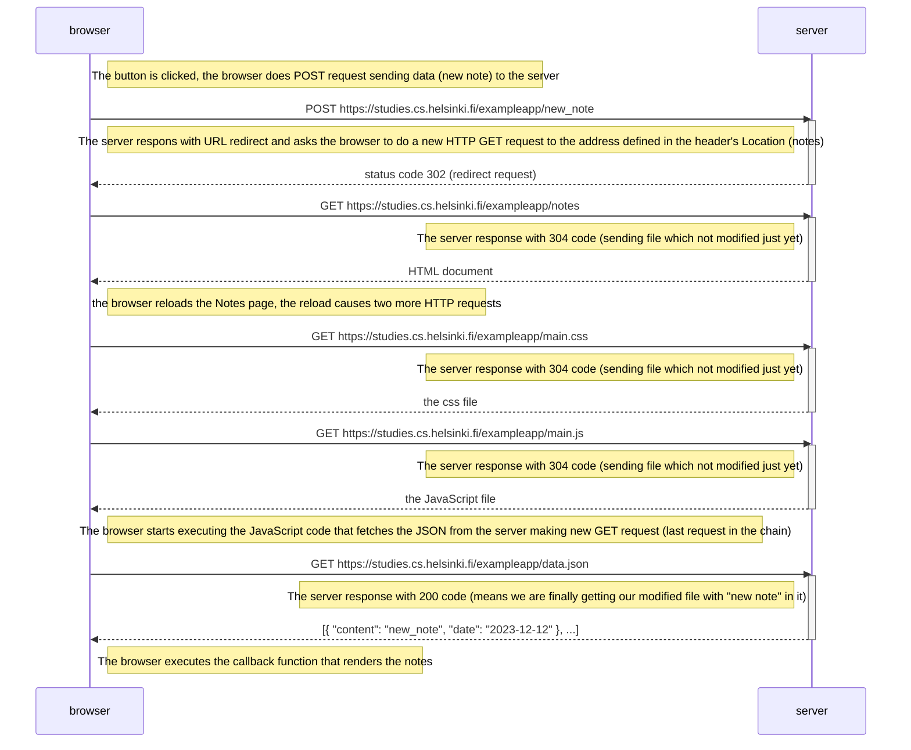

```mermaid
sequenceDiagram
Note right of browser: The button is clicked, the browser does POST request sending data (new note) to the server

browser->>server: POST https://studies.cs.helsinki.fi/exampleapp/new_note
    activate server
Note left of server: The server respons with URL redirect and asks the browser to do a new HTTP GET request to the address defined in the header's Location (notes)

    server-->>browser: status code 302 (redirect request)
    deactivate server


browser->>server: GET https://studies.cs.helsinki.fi/exampleapp/notes
    activate server

Note left of server: The server response with 304 code (sending file which not modified just yet)
    server-->>browser: HTML document
    deactivate server

Note right of browser: the browser reloads the Notes page, the reload causes two more HTTP requests

browser->>server: GET https://studies.cs.helsinki.fi/exampleapp/main.css
    activate server

Note left of server: The server response with 304 code (sending file which not modified just yet)
    server-->>browser: the css file
    deactivate server

    browser->>server: GET https://studies.cs.helsinki.fi/exampleapp/main.js
    activate server
Note left of server: The server response with 304 code (sending file which not modified just yet)
    server-->>browser: the JavaScript file
    deactivate server

Note right of browser: The browser starts executing the JavaScript code that fetches the JSON from the server making new GET request (last request in the chain)

browser->>server: GET https://studies.cs.helsinki.fi/exampleapp/data.json
    activate server
Note left of server: The server response with 200 code (means we are finally getting our modified file with "new note" in it)
    server-->>browser: [{ "content": "new_note", "date": "2023-12-12" }, ...]
    deactivate server

    Note right of browser: The browser executes the callback function that renders the notes
```