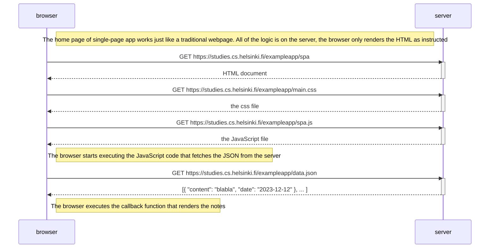

```mermaid
sequenceDiagram
    Note right of browser: The home page of single-page app works just like a traditional webpage. All of the logic is on the server, the browser only renders the HTML as instructed

    browser->>server: GET https://studies.cs.helsinki.fi/exampleapp/spa
    activate server
    server-->>browser: HTML document
    deactivate server

    browser->>server: GET https://studies.cs.helsinki.fi/exampleapp/main.css
    activate server
    server-->>browser: the css file
    deactivate server

    browser->>server: GET https://studies.cs.helsinki.fi/exampleapp/spa.js
    activate server
    server-->>browser: the JavaScript file
    deactivate server

    Note right of browser: The browser starts executing the JavaScript code that fetches the JSON from the server

    browser->>server: GET https://studies.cs.helsinki.fi/exampleapp/data.json
    activate server
    server-->>browser: [{ "content": "blabla", "date": "2023-12-12" }, ... ]
    deactivate server

    Note right of browser: The browser executes the callback function that renders the notes
```