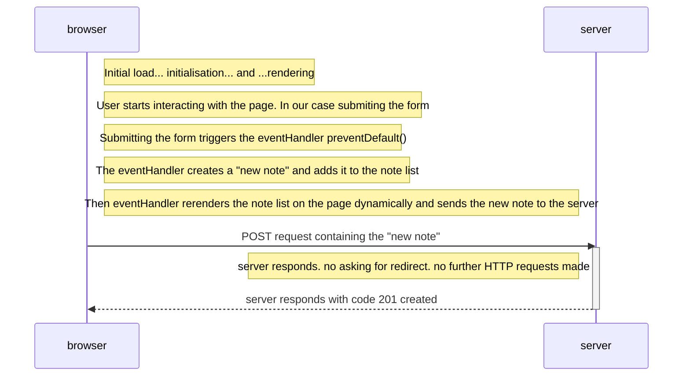

```mermaid
sequenceDiagram
    Note right of browser: Initial load... initialisation... and ...rendering
    Note right of browser: User starts interacting with the page. In our case submiting the form
    Note right of browser: Submitting the form triggers the eventHandler preventDefault() 
    Note right of browser: The eventHandler creates a "new note" and adds it to the note list
    Note right of browser: Then eventHandler rerenders the note list on the page dynamically and sends the new note to the server
    browser->>server: POST request containing the "new note"
    activate server
    Note left of server: server responds. no asking for redirect. no further HTTP requests made
    server-->>browser: server responds with code 201 created
    deactivate server
```